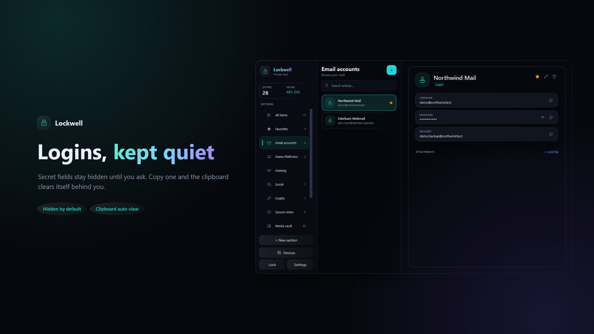
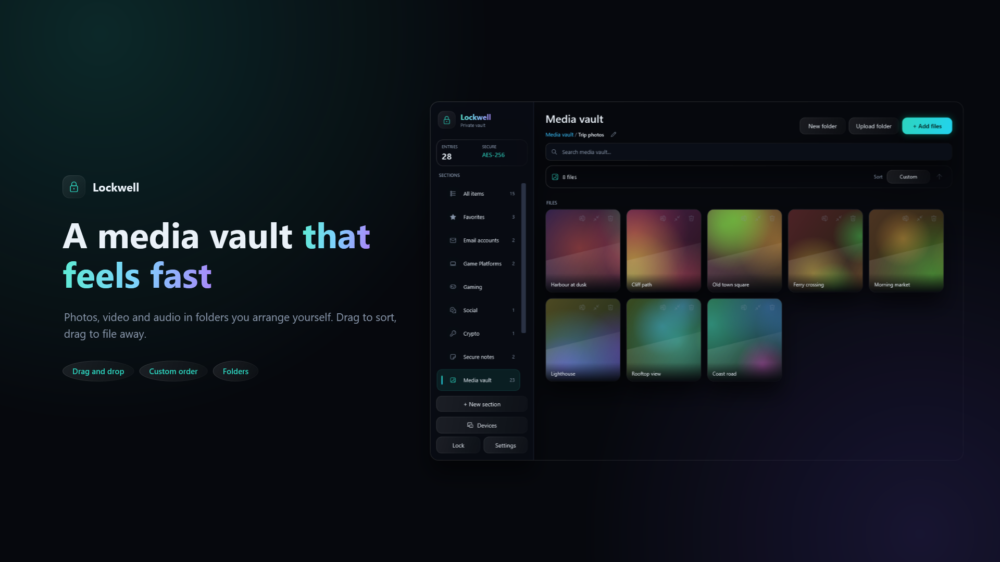
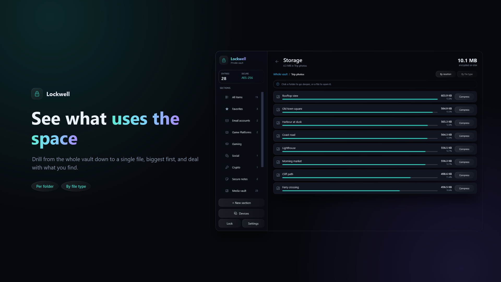
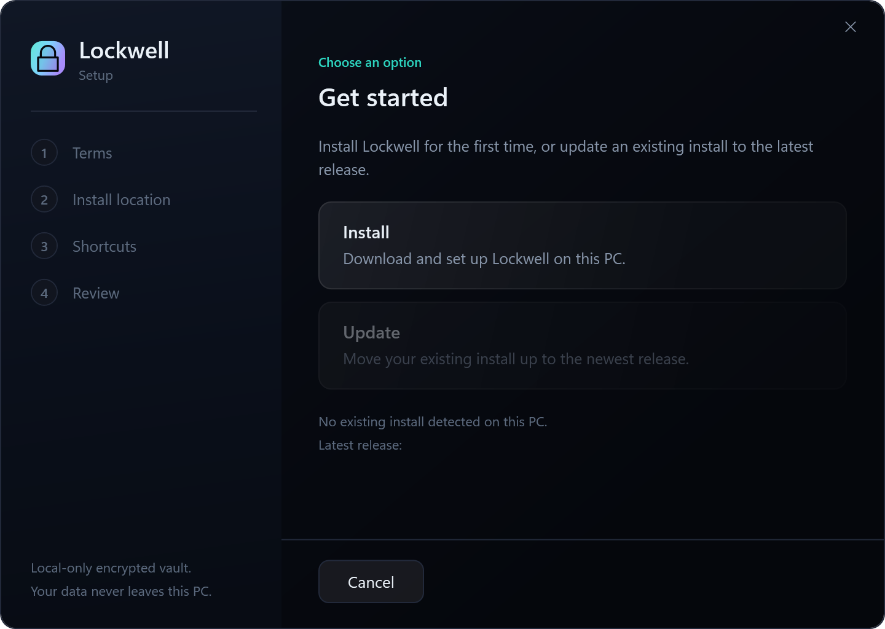

<div align="center">


Passwords, notes, keys and private media, behind one master password.
No account, no server, no sync you did not ask for.

[Download](https://github.com/slashneck/Lockwell/releases/latest) &middot;
[Threat model](docs/THREAT-MODEL.md) &middot;
[Vault format](docs/VAULT-FORMAT.md) &middot;
[Changelog](CHANGELOG.md)

</div>

---

## Why this exists

Most password managers ask you to trust a company with a copy of your secrets. Lockwell
asks you to trust your own disk. The vault file never leaves your machine, there is no
account to breach, and there is no recovery process that could be talked into handing
your data to someone else. Forget your master password and your recovery key, and the
data is gone. That is the trade, stated plainly.

The other half of the trade is that you can read every line of how it works. Security
software that asks for blind faith has it backwards.

<div align="center">







</div>

## Features

- **Encrypted at rest.** Argon2id (256 MiB, memory-hard) derives the key. AES-256-GCM
  encrypts the contents and detects tampering.
- **No cloud, no accounts, no telemetry.** One optional update check, which you can
  turn off.
- **Passwords, notes and files.** Images, video, audio and documents, all in the same
  vault.
- **Built-in media viewer.** Photos and GIFs are decrypted in memory and never written
  to disk.
- **Categories, folders and search.** Sorting that holds up once the vault gets big.
- **Storage breakdown.** Drill from the whole vault down to a single file to see what
  is using space.
- **Built-in compression.** Shrink photos, audio or video using the encoders already on
  your PC. Runs in memory, and you see the result before you commit to it.
- **Encrypted backups.** Export and restore backups you control.
- **Multiple profiles.** Separate vaults for separate parts of your life.
- **Screen-capture awareness.** Optional exclusion from OBS and similar tools, plus a
  warning before you type your password if a recorder is already running.
- **Auto-lock** on idle and on minimise. The clipboard clears itself after a copy.
- **Signed updates.** Every release is signed with an offline key. The app and the
  installer both check it before anything is written.

## Install

1. Download **LockwellSetup.exe** from the
   [latest release](https://github.com/slashneck/Lockwell/releases/latest).
2. Run it. It fetches the signed app package, verifies the signature, and installs.
3. Launch Lockwell, create a vault, and choose a master password.

<div align="center">



</div>

Windows 10 version 2004 or later, or Windows 11. 64-bit.

Your vault lives in `%LocalAppData%\Lockwell\`. Nothing in the installer or the app
package contains any data of yours.

**Write down the recovery key.** It is the only other way into your vault, and it is
shown once.

## Build it yourself

You do not have to trust the binaries.

```
git clone https://github.com/slashneck/Lockwell.git
cd Lockwell
dotnet build Lockwell/Lockwell.csproj -c Release
```

You need the .NET 8 SDK. The Android companion additionally needs the MAUI workload.

Before shipping anything, run the checks:

```
dotnet run --project Lockwell.Tests -c Debug --nologo
```

That harness is not a formality. It covers the vault round trip, the key derivation,
the wire protocol, the update trust chain, and a set of guards for bugs that got into
the app once already and are not allowed back in.

## Security

Lockwell is built to be as unreadable at rest as a local app can be, and honest about
where that stops.

`docs/THREAT-MODEL.md` documents what Lockwell protects against **and what it does
not**: keyloggers, malware on an unlocked machine, decrypted video in the temp folder
while it plays, why overwriting a file on an SSD is weaker than it sounds. Read it
before you decide this is the right place for something that matters.

Found a vulnerability? See [SECURITY.md](SECURITY.md).

## Project layout

| Path | What it is |
|---|---|
| `Lockwell/` | The Windows desktop app (WPF, .NET 8) |
| `Lockwell.Core/` | Crypto, vault format, sync protocol and update trust. Shared, no UI |
| `Lockwell.Installer/` | The setup and update program |
| `Lockwell.Tests/` | The verification harness |
| `Lockwell.Mobile/` | Android companion app (.NET MAUI, early) |
| `build-tools/` | Publish, obfuscation and release-signing tooling |
| `docs/` | Threat models, vault format, sync protocol |

## Android companion

An Android app is in the repository and is early. It holds only the items you
deliberately send to it, never a mirror of your PC vault, so losing the phone costs
only what was on it. Pairing happens over your local network with no server in the
middle. See `docs/MOBILE-COMPANION-PLAN.md` and `docs/SYNC-PROTOCOL.md`.

## Licence

GPL-3.0-or-later. See [LICENSE](LICENSE).

That choice is deliberate. Anyone may use, study, modify and share Lockwell, and
anyone who distributes a modified build has to hand over their source too. A vault you
cannot inspect is a vault you are taking on faith.

Third-party components and their licences are listed in
[THIRD-PARTY-NOTICES.md](THIRD-PARTY-NOTICES.md).

Copyright 2026 Lockwell.
